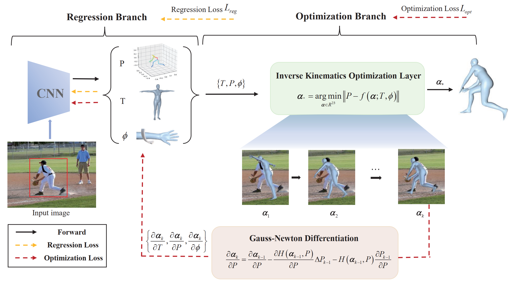

# IKOL

[//]: # ([![PWC]&#40;https://img.shields.io/endpoint.svg?url=https://paperswithcode.com/badge/hybrik-a-hybrid-analytical-neural-inverse/3d-human-pose-estimation-on-3dpw&#41;]&#40;https://paperswithcode.com/sota/3d-human-pose-estimation-on-3dpw?p=hybrik-a-hybrid-analytical-neural-inverse&#41;)

<div align="center">

</div>


Code repository for the paper:

**IKOL: Inverse kinematics optimization layer for 3D human pose and shape
estimation via Gauss-Newton differentiation**

Juze Zhang, Ye Shi, Yuexin Ma, Lan Xu, Jingyi Yu, Jingya Wang


[[`Paper`](http://arxiv.org/abs/2302.01058)]
[[`Project Page`](https://juzezhang.github.io/IKOL-webpage/)]

In AAAI 2023


## Installation instructions

``` bash
# 1. Create a conda virtual environment.
conda create -n IKOL python=3.8 pytorch=1.11 cudatoolkit=11.3 torchvision -c pytorch -y
conda activate IKOL

# 2. Install mmcv-full
pip install openmim
mim install mmcv-full

# 3. Install PyTorch3D
conda install -c fvcore -c iopath -c conda-forge fvcore iopath -y
conda install -c bottler nvidiacub -y
conda install pytorch3d -c pytorch3d -y

# 4. Pull our code
git clone https://github.com/Juzezhang/IKOL.git
cd IKOL

# 5. Install
pip install -e .
```

## Pretrained models and Dataset
* Download the SMPL model `basicModel_neutral_lbs_10_207_0_v1.0.0.pkl` from [here](https://smpl.is.tue.mpg.de/) at `common/utils/smplpytorch/smplpytorch/native/models`.
* Download our pretrained model [ [Google Drive](https://drive.google.com/drive/folders/1dRN_WPXzGoGF_r2rZiNJVlfHdLcvmPxF?usp=sharing)] to re-implement our results in Tab. 1 of the main paper.
* Thanks to the great job done by [Li et al](https://openaccess.thecvf.com/content/CVPR2021/html/Li_HybrIK_A_Hybrid_Analytical-Neural_Inverse_Kinematics_Solution_for_3D_Human_CVPR_2021_paper.html), we use the dataset formats provided in [HybrIK](https://github.com/Jeff-sjtu/HybrIK)


## Evaluation
``` bash
python ./scripts/validate.py --batch 64 --gpus 0 --world-size 1 --launcher pytorch --rank 0 --dist-url tcp://${HOST}:${PORT} --cfg ${CONFIG} --checkpoint ${CKPT} --flip-test --dataset 3DPW/3DHP --loader_type mmloader/hybrik_loader
```
e.g. evaluate on 3DPW
``` bash
CUDA_VISIBLE_DEVICES=0 python ./scripts/validate.py --batch 64 --gpus 0 --world-size 1 --launcher pytorch --rank 0 --dist-url tcp://127.0.0.1:23456 --cfg ./configs/IKOL_resnet34_mmloader.yaml --checkpoint ./checkpoints/pretrained_3dpw_finetune_hybrikloader.pth --flip-test --dataset 3DPW --loader_type hybrikloader
```


## Training

Our approach incorporates two distinct data loader formats, sourced from the [HybrIK](https://github.com/Jeff-sjtu/HybrIK) repository and [mmhuman3d](https://github.com/open-mmlab/mmhuman3d). For the fine-tuning process, we have utilized the HybrIK loader. In addition, we train our own model from the stretch with mmloader. Here two implement example. Below are examples of both implementations.

Training with hybrik loader(only finetune):
``` bash
python ./scripts/train_hybrikloader.py -nThreads 0 --launcher pytorch --rank 0 --dist-url tcp://127.0.0.1:23456 --exp-id train_res34 --cfg ./configs/IKOL_resnet34_hybrikloader_finetune.yaml --seed 123123
```

Training with mmloader:
``` bash
python ./scripts/train_mmloader.py -nThreads 0 --launcher pytorch --rank 0 --dist-url tcp://127.0.0.1:23456 --exp-id train_res34 --cfg ./configs/IKOL_resnet34_mmloader.yaml --seed 123123
```


## Acknowledgement
The implementation was heavily built upon [HybrIK](https://github.com/Jeff-sjtu/HybrIK) and [mmhuman3d](https://github.com/open-mmlab/mmhuman3d). We thank the authors for their generosity to release code.


## Citing
If our code helps your research, please consider citing the following paper:

      @inproceedings{
            zhang2023ikol,
            title={IKOL: Inverse kinematics optimization layer for 3D human pose and shape estimation via Gauss-Newton differentiation},
            author={Juze Zhang and Ye Shi and Yuexin Ma and Lan Xu and Jingyi Yu and Jingya Wang},
            booktitle={Proceedings of the AAAI Conference on Artificial Intelligence (AAAI)},
            year={2023},
      }
      
